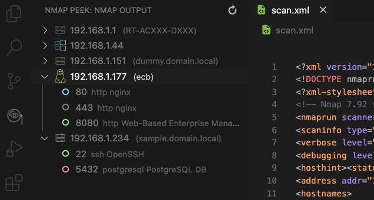
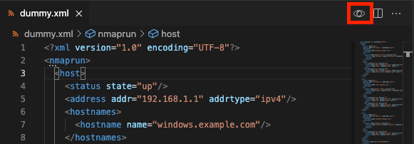

# Nmap-Peek

An easy way to preview the content of an XML nmap file, in VS Code.

## Features

A simple side view of your XMl nmap file. The extensions prints all the basic information retrieved from an nmap scan. 

## Display GUI

When an `.xml` file is open on the editor, an icon of an eye will become visible on the toolbar.

It is possible to run the command directly without writting the command by opening the Command Palette (`Ctrl + Shift + P` or `command + Shift + P`). After run the `nmap: Visualize Nmap` command.

The colors for port status are `green` dot for `open`, `red` for `closed`, `yellow` for `filtered` or `mixed response`.

## Requirements

The application is using `fast-xml-parser` for parsing the XML content of nmap. 

## Known Issues

it is not possible to have multiple instances of the preview at the same time.

## Release Notes

### 2.0.1

Fixed bug when host was down

### 2.0.0

Use latest version of `fast-xml-parser`
Extension completely re-written to use `Webview` instead of `TreeView`
New UI
Search option added
New action icon
Diplays more Nmap fields like:
- script output
- preview scanned ports
- Nmap scan info
- MAC and IPv6 addresses
- CPE information

### 1.0.5

Fixed bug in single host nmap scans
Fixed bug when host is offline

### 1.0.4

Fixed bug in single host nmap scans
Parsing OS directly

### 1.0.3

Fixed bug in case a single port was open.
Refactored code to avoid duplicate snippets

### 1.0.2

Improved error handling.

### 1.0.1

Updated needed license information and missing icons.

### 1.0.0

Initial release of nmap peek.