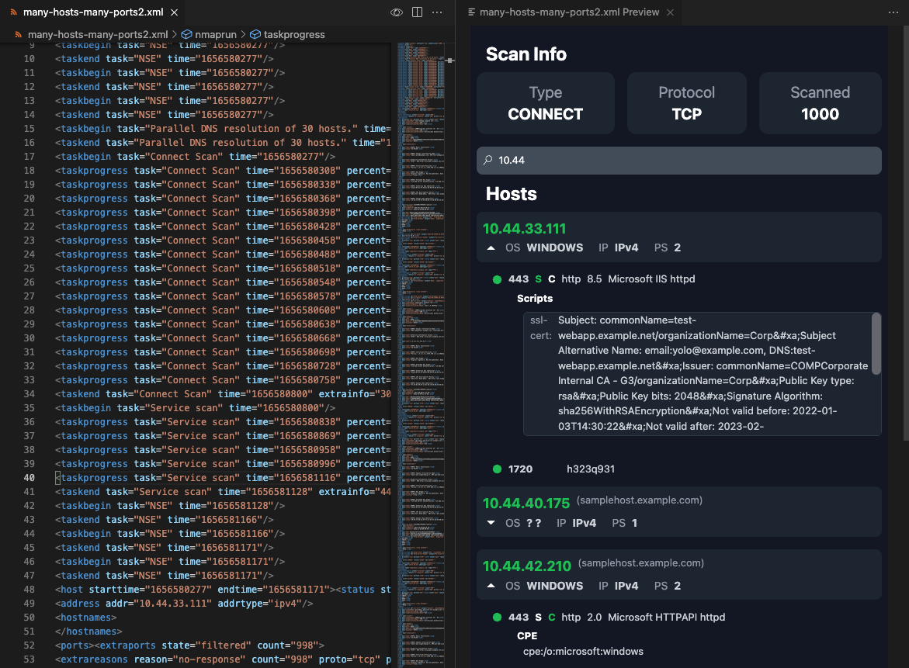

# Nmap-Peek

An easy way to preview the content of an XML nmap file, in VS Code.

## Features

A simple side view of your XMl nmap file. The extensions prints all the basic information retrieved from an nmap scan. 

The status of each port, is represented with different colors. `Green` for `open`, `red` for `closed`, `light blue` for `filtered` and `gray` for `mixed responses` like closed|filtered etc. In case the ports disclose the OS of the host, a related icon will be presented. 

## Requirements

The application is using `fast-xml-parser` for parsing the XML content of nmap. 

## Known Issues

In case you get an error `nmapViewer.refresh not found` after freshly installing the extension, you have to restart VS code.
You can either close it and start it again, or press `ctrl/cmd` + `shift` + `p` and select `Developer: Reload Window`.
After that, the extension will work as expected. 

## Release Notes

### 1.0.5

Fixed bug in single host nmap scans
Fixed bug when host is offline

### 1.0.4

Fixed bug in single host nmap scans
Parsing OS directly

### 1.0.3

Fixed bug in case a single port was open.
Refactored code to avoid duplicate snippets

### 1.0.2

Improved error handling.

### 1.0.1

Updated needed license information and missing icons.

### 1.0.0

Initial release of nmap peek.